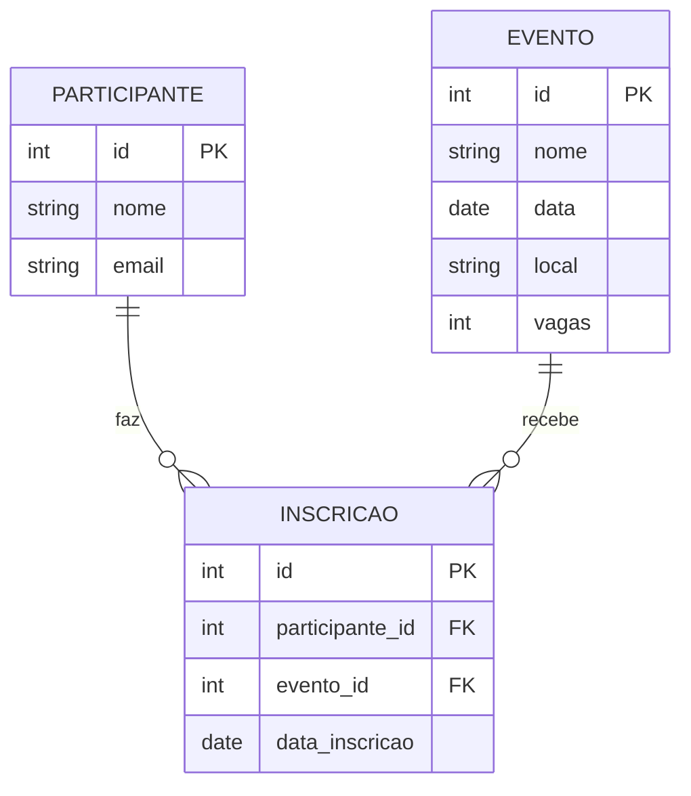

# DER — Sistema de Eventos Acadêmicos

```mermaid
erDiagram
    PARTICIPANTE ||--o{ INSCRICAO : "faz"
    EVENTO       ||--o{ INSCRICAO : "recebe"
    PARTICIPANTE {
      int id PK
      string nome
      string email
    }
    EVENTO {
      int id PK
      string nome
      date data
      string local
      int vagas
    }
    INSCRICAO {
      int id PK
      int participante_id FK
      int evento_id FK
      date data_inscricao
    }
```
